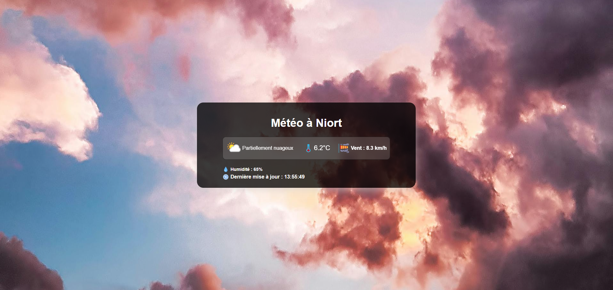

# 🌤️ Application Météo 

## Présentation du projet

Ce projet consiste à développer une application météo simple et lisible, destinée à être affichée sur les écrans d’une agence de transports en commun avec les technologies web, embarquées dans la webview.  
L’objectif est de présenter la météo en temps réel d’une ville précise, définie dans un fichier de configuration, à l’aide d’une API météo ouverte.

---

## 🖼️ WEB VIEW – Aperçu de l’interface

---

# 🎯 Objectifs

Ce projet répond aux exigences suivantes :

## ✔️ 1. Aucune saisie utilisateur
L’utilisateur ne choisit pas la ville.  
La ville est définie dans un fichier de configuration 

## ✔️ 2. Utilisation d’une API météo ouverte
L’application utilise **WeatherAPI** pour récupérer :

- la température  
- l’humidité  
- la vitesse du vent  
- l’icône météo  
- la description du ciel
 

## ✔️ 3. Structure des fichiers imposée
Le projet se compose de :

 - index.html → Structure de l’interface
 - css/style.css → Mise en forme
 - js/meteo.js → Logique métier et appels API
 - conf.json → Ville configurée
 - images/ → Icônes et background

## ✔️ 4. Récupération des données & affichage

- Lecture de la ville dans `conf.json`
- Appel à l’API météo via `fetch()`
- Conversion des données API au format JSON
- Affichage dynamique dans l’interface avec le DOM

## ✔️ 5. Rafraîchissement automatique
Les données météo sont mises à jour automatiquement **toutes les heures** 

## ✔️ 6. Débugage console
Les éventuelles erreurs sont affichées via la console de l'inspecter.

